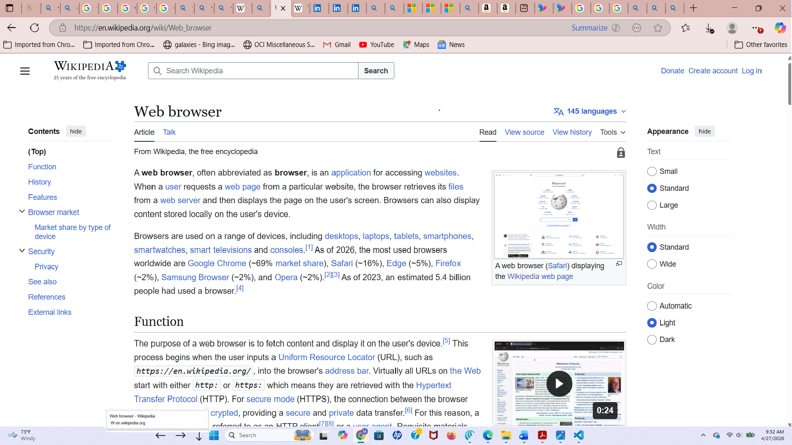

# PowerToys Proposal: Browser Tab Name Display (BTND)

Browser Tab Name Display (BTND) is a proposed PowerToys utility for Windows 11 that displays the title of the currently active tab or document in a compact, taskbar-adjacent strip so that it remains readable even when tab captions become too small to be useful. Although browsers are an obvious use case, tabbed PDF viewers, Adobe Acrobat Reader, Office Tabs for Microsoft Office, and development tools such as Visual Studio Code also support tab navigation through the same common shortcut family, making them viable targets for the same utility model.

## Overview

BTND should be designed as a Windows-level productivity utility for tabbed applications broadly, not just as a browser helper. At the platform level, it would detect the active foreground window, attempt to read the visible caption or title associated with the currently open tab in that window when available, and show that text in a small taskbar-adjacent strip when the feature is active.

BTND combines two closely related functions. First, it exposes the current tab or document title in a larger, easier-to-read strip near the taskbar. Second, it provides left and right arrow controls in that same area so the user can step through tabs or tab-like documents from the taskbar itself. Even in applications where a clean per-tab title cannot always be resolved, the stepping function should still remain useful as a general-purpose tab-navigation aid.

## Problem

When many tabs or tabbed documents are open, the visible captions often become too small to read comfortably, and the user may know only roughly where the desired tab is located. This creates both a readability problem and a precision problem, because aiming at tiny tab headers increases the chance of selecting the wrong item or clicking a close button by mistake.

That problem appears across multiple application families, not just browsers. Acrobat Reader supports moving to the next and previous open document tab with Ctrl+Tab and Ctrl+Shift+Tab, Office Tabs documents the same pattern for moving through tabs, and Visual Studio Code also supports these shortcuts or equivalent remappings alongside Ctrl+PageUp and Ctrl+PageDown navigation patterns.

## Proposed behavior

BTND would present a small collapsible title strip immediately above the Windows taskbar near the Start area instead of using a floating overlay that must be manually positioned. The strip would occupy a narrow reserved area, approximately 2 inches wide and about 0.4 inches high, with the right edge aligned near the left edge of the Windows Start icon, and the displayed title would wrap into two lines in a tooltip-like font style for readability.

The strip should appear only in reserved or safe space so that it never obscures important desktop content, shell information, application status bars, or specialized software UI. The expand/collapse control should remain in the taskbar area, and left/right arrows should be a permanent part of the interface because navigation is central to the concept, not an optional extra.

## Activation and reset

BTND should work only when a supported tabbed application window is maximized and is the foreground window currently visible to the user. When the user clicks the up arrow, the feature turns on for that active window and initializes the strip by displaying the current tab or document title when available. Subsequent tab changes within that same window should update the displayed title automatically when a new usable title can be obtained.

The feature should automatically deactivate, and the down arrow should revert to an up arrow, whenever the user minimizes the window, restores it to a non-maximized size, or switches focus to another supported tabbed application window. The user must reinitialize the feature by clicking the up arrow for any newly focused maximized window if they want BTND active there. If the user clicks the up arrow in a non-maximized window, the strip should not appear and the feature should remain inactive.

### Expected user mental model

- Maximize a supported tabbed application window.
- Click the up arrow to activate BTND for that window and show the current title.
- Change tabs and watch the strip update automatically.
- If the window is no longer maximized or is no longer the foreground window, BTND turns off and must be activated again.

## Title display and movement

BTND should treat title display and tab movement as related but separable behaviors. If the application exposes a usable foreground caption or document title, BTND should display that title in the strip. If the application does not expose a clean tab name through normal Windows mechanisms, BTND should still allow the user to move backward or forward through tabs with the taskbar arrows.

This distinction matters because shortcut support is broader and more uniform than title exposure. Acrobat Reader documents next and previous open document tab shortcuts directly, Office Tabs documents next and previous tab movement, and VS Code supports tab switching through Ctrl+Tab and Ctrl+Shift+Tab behavior or configurable equivalents, even though exact traversal order can vary by application settings.

## Tab stepping

A core part of BTND is the ability to move left and right through tabs from the taskbar while reading each active tab or document title in the strip whenever title information is available. Once the feature has been initialized for the current window, the present tab name should be displayed and the user should be able to move left or right from tab to tab using the taskbar arrows, with the newly active title shown after each move when a title can be tracked.

The left and right arrow icons should always be present in the interface. When the user clicks the left arrow, the utility should first attempt Ctrl+Shift+Tab, and when the user clicks the right arrow, it should first attempt Ctrl+Tab; if the tracked title remains unchanged after approximately 200 ms, the utility should then fall back to Ctrl+PageUp for left movement or Ctrl+PageDown for right movement. This ordering matches common next/previous tab behavior in the most popular browsers, Acrobat Reader, and Office Tabs while still leaving room for applications that respond more predictably to PageUp/PageDown tab commands.

BTND should describe this operationally rather than promising identical adjacency semantics in every application. In some tools, especially editors like VS Code, Ctrl+Tab and Ctrl+Shift+Tab may operate in recently used order unless remapped, while Ctrl+PageUp and Ctrl+PageDown may correspond more closely to physical tab order.

## Application scope

BTND should target the most common tabbed Windows workflows, including:

- Web browsers.
- PDF and document viewers with tabs, including Acrobat Reader-style interfaces.
- Office environments that use Office Tabs to place many documents into one tabbed window.
- Editors and development tools such as Visual Studio Code, where open files already live in a tabbed model.

This scope gives the proposal a stronger Windows-wide productivity case. The same compact taskbar strip and arrow-based movement can help users navigate crowded tab strips across reading, editing, browsing, and document-review workflows.

## Compatibility model

A practical compatibility model for BTND is:

| Application family | Common next-tab behavior | Common previous-tab behavior | BTND value |
|---|---|---|---|
| Browsers | Ctrl+Tab or Ctrl+PageDown | Ctrl+Shift+Tab or Ctrl+PageUp | Readable title display plus navigation. |
| Acrobat Reader and similar tabbed PDF viewers | Ctrl+Tab | Ctrl+Shift+Tab | Strong match for document-tab movement. |
| Office Tabs for Microsoft Office | Tab movement documented with Ctrl+Tab family and previous-tab movement with Ctrl+Shift+Tab. | Ctrl+Shift+Tab. | Strong match for document workflows. |
| VS Code and similar editors | Ctrl+Tab or Ctrl+PageDown, depending on configuration and command binding. | Ctrl+Shift+Tab or Ctrl+PageUp, depending on configuration and command binding. | Useful even when traversal order is history-based. |

The key design point is that BTND does not need identical application internals to be valuable. It only needs a reliable way to detect the active foreground window, attempt to surface a title when possible, and send the most widely supported tab-navigation shortcuts in a sensible order.

## Technical approach

The preferred first implementation is a lightweight native Windows desktop utility using standard Win32 APIs on Windows 11 x64 and ARM64. A first prototype can detect the active foreground window, read its caption text, determine whether that window is maximized, and display the resulting text in a passive taskbar-adjacent surface using foreground-window tracking, caption reading, timer-driven updates, taskbar-aware positioning, and non-activating popup behavior.

The implementation should separate the title layer from the navigation layer. The title layer is opportunistic and display-oriented: it shows the best usable foreground caption BTND can retrieve. The navigation layer is shortcut-driven: it continues to send left/right tab commands even when title extraction is incomplete or inconsistent in a given application.

## Staged implementation

A practical staged plan would be:

- **Stage 1:** Foreground-window caption display in the three most popular web browsers, plus universal tab stepping for active maximized tabbed applications using Ctrl+Shift+Tab and Ctrl+Tab first, then Ctrl+PageUp and Ctrl+PageDown as fallback.
- **Stage 2:** Reliability improvements for title capture across more tabbed application families, including PDF/document viewers, Office tab shells, and editors.
- **Stage 3:** Optional application-aware refinements for apps whose traversal behavior differs meaningfully, such as history-ordered tab switching in editors.

This staging keeps the first version useful across many real-world workflows while leaving room for later refinement where application-specific behavior warrants it.

## Estimated implementation effort

A realistic estimate for a solid first implementation is about 300 to 450 hours of engineering work, or roughly 6 to 12 developer-weeks, depending on how much cross-application testing and polish is included. A narrower proof of concept could be built more quickly, but a credible utility that works reliably across browsers, tabbed PDF viewers, Office Tabs, and editors would require more validation and refinement.

In cost terms, a practical first version would likely fall in the range of about $30,000 to $65,000 if developed externally, with lower costs possible for a prototype and higher costs likely for a more polished cross-application release. The main effort is not drawing the taskbar-adjacent strip itself, but making activation, title capture, fallback shortcut behavior, and application compatibility feel dependable in everyday use.

## Why PowerToys fits

BTND fits PowerToys because it is a lightweight Windows productivity enhancement rather than a change to any one application. PowerToys is strongest when it offers practical shell-adjacent utilities that improve many everyday workflows without requiring unsupported shell modifications or deep invasive integrations.

A utility that shows readable tab or document titles when possible and still provides practical backward/forward tab movement when titles are not available is well aligned with that mission. Because common tab-navigation shortcuts already appear across browsers, document viewers, Office tab environments, and editors, BTND has a stronger cross-application rationale than a browser-only framing would suggest.

## Request

BTND can be considered as a new PowerToys utility or experimental prototype concept for Windows 11. The strongest value case is for users who work with many tabs or tabbed documents in a single maximized window and want a safer, easier way to identify and move through them from the taskbar without relying solely on tiny tab headers or awkward direct pointer targeting.


## Mockup



[← Back to summary](../README.md)
```
