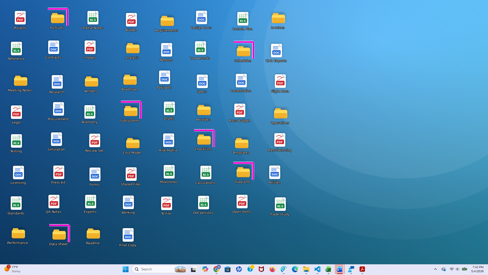

# On-demand desktop open-folder highlighter

## At a glance

### What it does

- Temporarily highlights desktop folders that are currently open in File Explorer.
- Runs only when the user turns it on with a global hotkey or a system tray toggle.
- Uses a temporary rendering layer instead of shell icon overlays.

### What it does not do

- It does not try to detect all open files such as Word, Excel, PDF, image, browser, or editor documents.
- It does not create an always-on desktop state.
- It does not replace or compete with OneDrive or Tortoise-style overlay badges.

### Why it is useful

- Helps users quickly see which desktop folders are already active.
- Makes desktop cleanup and reorganization easier.
- Reduces duplicate opening of folders that are already open.

## Proposal summary

On-demand desktop open-folder highlighter is a proposed Windows productivity utility, well suited to a PowerToys-style implementation, that temporarily highlights desktop folders whose corresponding folders are currently open in File Explorer. The feature is intentionally on-demand rather than always on: a user invokes it with a hotkey, tray command, or similar activation method, briefly sees which desktop folders are already open, and then dismisses it so the desktop immediately returns to its normal appearance.

The proposal deliberately narrows scope to open desktop folders only. It does not attempt to highlight every open desktop file such as Word documents, Excel workbooks, PDFs, images, browser-downloaded files, or other application-specific items, because that broader goal is substantially more complex, less reliable, and more error-prone across the wide range of Windows applications and window models.

Even with that narrowed scope, the feature remains useful. Many users treat the desktop as a working surface with project folders arranged spatially for temporary organization, and when several of those folders are already open in File Explorer, it becomes difficult to remember which folders are active and where they sit on the desktop. A temporary "show me which desktop folders are already open" mode can make desktop reorganization easier, reduce repeated scanning, and lower the chance of opening duplicate Explorer windows.

## Problem and value

Some users use the Windows desktop not as a minimal drop zone but as a live workspace containing project folders, shortcuts, and reference material arranged in a meaningful layout. On crowded desktops, especially those with dozens of icons, large displays, or multiple ongoing projects, it is hard to tell at a glance which desktop folders are already open in File Explorer.

The practical consequence is small but persistent friction. Users may visually rescan the desktop multiple times, hesitate before opening a folder because they are unsure whether it is already open, or accidentally create duplicate Explorer windows for the same project folder. The proposal therefore focuses on a simple question with a clear answer: which desktop folders are already open right now?

Representative scenarios include:

- A user with 70 desktop icons wants to know which project folders are already open before rearranging icons into a cleaner layout.
- A user working across several folders on a large monitor wants a quick visual reminder of which desktop folders are already active rather than repeatedly scanning taskbar thumbnails or open Explorer windows.
- A user with similar-looking project folder names wants to avoid opening duplicate Explorer windows for folders that are already in use.

## Scope and tradeoffs

The strongest design choice in this proposal is the decision to stay folder-only. Desktop folders opened in File Explorer are a comparatively well-bounded problem because Explorer windows can be identified, their current folder paths can be resolved, and those paths can be matched against folders physically present on the desktop. That makes the resulting behavior easier to explain, easier to test, and more likely to be accurate in real use.

Trying to highlight all open desktop files across many application types would introduce a much more difficult and less reliable detection problem. A `.docx` file may be open in Word, a `.pdf` in Acrobat or a browser tab, an `.xlsx` in Excel, and an image in Photos or Photoshop. Some applications expose a clear file path in the window model, some hide it, some show only partial titles, and some represent multiple documents in tabs. A feature that guesses wrong would create visible false highlights, which is worse than making a clear and honest folder-only promise.

This narrowed scope improves the product on four dimensions:

- Correctness.
- Simplicity.
- Testability.
- Feasibility.

## Product principles

The feature should follow a few clear principles:

- On-demand, not persistent.
- Folder-first and folder-only for the proposed scope.
- Lightweight and non-destructive to the normal desktop state.
- Accurate enough to trust, rather than broad but error-prone.
- Visually useful on crowded desktops while remaining easy to dismiss.
- Independent of shell overlay slots and existing sync-status systems.

## Proposed experience

The experience should be simple enough to explain in a sentence. The user invokes the feature, the desktop briefly highlights all desktop folders that are currently open in File Explorer, the markers update while the mode remains active, and the markers disappear as soon as the user turns the mode off.

### Activation methods

- Global hotkey.
- System tray toggle.
- Optional settings-page test button for discovery and debugging.

### User guide text

There are two simple ways to turn the on-demand desktop open-folder highlighter on and off. A global hotkey lets the user toggle the feature from anywhere in Windows using a keyboard shortcut, such as Ctrl + Alt + O. The user presses the shortcut once to highlight all desktop folders that are currently open in File Explorer, then presses it again to clear the highlights and return the desktop to normal.

A system tray toggle provides a mouse-friendly option: after installing the utility, an icon appears in the taskbar's notification area near the clock. The user can click this icon, or choose **View open folders** from its menu, to turn the highlighting mode on, and click again to turn it off. Both options perform the same action; the hotkey is faster for frequent use, while the tray icon is easier to discover and convenient for mouse-oriented users.

To avoid conflicts with other software, the utility should provide a sensible default global hotkey and also allow the user to change it in settings so a different key combination can be chosen if the default is already in use.

### Visual treatment

The visual treatment should be noticeable without making the desktop feel boxed in or cluttered. A strong candidate is a partial corner frame rather than a full rectangle, for example a horizontal line above the icon combined with a vertical line on the right side meeting at the top-right corner. This style can signal "active" without covering too much icon art or creating the heavy feel of many complete boxes on a crowded desktop.

The proposal already includes two supporting visuals in the original document: a desktop mockup showing multiple open folders highlighted, and a simple tray icon that mirrors the same corner-frame language.

### Active and inactive behavior

While active, the utility should build or refresh the set of folders physically present on the desktop, detect which of those desktop folders are currently open in File Explorer, resolve their on-screen icon positions, draw temporary markers around or near those folder icons using a separate rendering layer, and refresh the highlights while the mode remains on so the display reflects newly opened or closed Explorer windows.

When inactive, the utility should do nothing visible. No persistent markers should remain, no desktop icons should be modified, and all existing Explorer or sync overlays should continue to behave exactly as they normally do.

## Why the design avoids shell overlays

Traditional shell icon overlays are not a good match for this feature. The desired behavior is temporary, user-invoked, and inspection-oriented rather than a permanent icon state. More importantly, shell overlays are a constrained system resource, only one overlay can appear on a given icon, and many machines already use overlays for OneDrive sync state, Dropbox indicators, Box status, or Tortoise-style version-control markers.

Because of those constraints, an overlay-based implementation would likely conflict with real-world user setups and behave inconsistently across machines. The proposal therefore uses an independent temporary rendering layer shown only when requested, which better matches the intended "show me now, then go away" interaction model.

## Technical architecture

The implementation can remain modular and relatively contained because the scope is intentionally limited to open desktop folders in File Explorer. The architecture can be unified into six cooperating components.

1. **Activation controller** — manages the hotkey, tray command, and optional settings-based test control, and owns the active or inactive state of the mode.
2. **Desktop indexer** — enumerates items physically present on the desktop and builds a canonical path map for matching, while limiting active candidates to folders.
3. **Open-folder detector** — identifies relevant Explorer windows, resolves which folder path each one represents, and returns the subset that matches desktop folders.
4. **Desktop view adapter** — resolves the visual position of desktop folder icons so the renderer knows where to place markers.
5. **Highlight renderer** — creates the temporary visual layer used to mark open desktop folders without interfering with normal icon interaction.
6. **State coordinator** — manages refresh timing, redraws, and cleanup while the mode is active.

### Unified data flow

1. The user enables the mode through a hotkey, tray command, or optional settings-page test control.
2. The desktop indexer refreshes the current desktop folder map.
3. The open-folder detector computes which indexed desktop folders are currently open in File Explorer.
4. The desktop view adapter resolves icon positions for those indexed folders.
5. The renderer draws markers for the subset that is open.
6. While active, the coordinator repeats detection and redraw checks as needed.
7. When disabled, the renderer is destroyed and temporary state is cleared immediately.

## Edge-case behavior

- **If Explorer restarts while the mode is active**, the utility should clear stale markers, wait for the desktop view to recover, and then re-resolve the desktop state before drawing again.
- **If the user rearranges desktop icons while the mode is active**, the utility should detect the layout change and refresh icon bounds before the next redraw.
- **If display scaling, icon size, or monitor arrangement changes**, the utility should re-query icon positions instead of assuming old coordinates remain correct.
- **If the global hotkey is already in use**, the utility should reject the conflicting shortcut and prompt the user to choose another.
- **If the renderer fails**, the layer should be removed cleanly so the desktop never remains in a half-active or visually stale state.

## Scope definition

### Included

- Windows 11 support.
- On-demand temporary highlighting only.
- Desktop folders as the only highlight target.
- Detection limited to desktop folders currently open in File Explorer.
- Temporary visual markers rendered independently of shell overlays.
- Automatic cleanup when the mode is turned off.
- Refresh behavior while active so the highlighted set remains current.

### Excluded

- Always-on desktop markers.
- Shell icon overlay handlers.
- Tracking arbitrary open files across applications.
- Attempting to highlight Word, Excel, PowerPoint, PDF, image, browser, editor, or other non-folder document windows.
- Rewriting Explorer icon rendering or permanently changing desktop icon appearance.
- Any claim that the utility understands all open desktop items.

## QA and validation plan

### Test environments

- Windows 11 current stable build.
- x64 and ARM64 systems where available.
- Single-monitor and multi-monitor setups.
- 100, 125, 150, and 200 display scaling.
- Small, medium, and large desktop icon sizes.
- Light and dark Windows themes.
- Systems with OneDrive and at least one Tortoise-style tool installed.

### Core test areas

- Turning the mode on displays markers for desktop folders that are currently open in File Explorer.
- Turning the mode off removes all markers immediately.
- Closed folders do not remain highlighted.
- Repeated activation and dismissal does not leave stale UI state behind.
- Layouts with 50, 75, and 100 or more icons.
- Mixed desktops containing folders, files, and shortcuts, while only folders are eligible for highlighting.
- Busy wallpapers and simple wallpapers.
- High-DPI environments and small icon layouts.
- Explorer restart while active.
- Desktop refresh events.
- Rearranging icons while active.
- Changes in scaling, monitor arrangement, or desktop layout during use.
- Add basic logging or telemetry for crashes and edge failures in the highlight renderer and open-folder detector.

### Example pass criteria

- No persistent marker remains after the mode is disabled.
- Open desktop folders are highlighted at the correct icon positions.
- Highlight updates remain accurate while the mode is active.
- The desktop remains selectable and usable while highlights are visible.
- Existing sync and version-control overlays still appear normally when the mode is inactive.
- The feature remains understandable and visually useful on crowded desktops.

## Implementation phases and effort

### Phase 1: feasibility and prototype

- Validate desktop indexing for desktop folders.
- Validate Explorer-window detection and folder-path matching.
- Validate icon-position lookup and prototype marker drawing.

### Phase 2: integrated internal build

- Add activation methods such as hotkey and tray command.
- Integrate the desktop indexer, detector, desktop view adapter, renderer, and coordinator.
- Begin stability testing across icon sizes, wallpapers, monitor layouts, and scaling modes.

### Phase 3: hardening and usability refinement

- Improve redraw behavior and dismissal reliability.
- Tune marker visibility and clutter tradeoffs.
- Validate coexistence with OneDrive and Tortoise-style tools.

### Phase 4: release candidate

- Freeze the folder-only scope.
- Finalize settings, QA signoff, and documentation.
- Ship as an on-demand desktop open-folder highlighter rather than as a generalized open-item tracker.

A realistic implementation note for decision-makers: this is a narrow feature, but it is still specialized Windows desktop work. A solid V1 would likely take roughly 8 to 12 weeks for a small experienced team, with additional time if the project requires deeper hardening across many display and shell configurations.

## Why this is a strong PowerToys candidate

This concept appears well aligned with the PowerToys model. It targets a real but somewhat specialized workflow, offers immediate productivity value for a subset of users, stays optional rather than changing the default Windows shell, and can be implemented as a utility rather than a broad shell redesign.

## Recommendation

The integrated proposal should move forward only as a folder-only feature and should be named **On-demand desktop open-folder highlighter**. That name is more accurate than a broader "open-item" framing because it matches the actual reliable scope of the feature and avoids suggesting cross-application file intelligence that the proposal does not intend to deliver.

The best version of this idea is not the broadest version. It is the version that solves one concrete problem well: letting users temporarily see which desktop folders are already open in File Explorer so they can inspect, manage, and reorganize their desktop with less scanning, less guessing, and less duplicate opening.

## Supporting visuals




[← Back to summary](../README.md)
```
