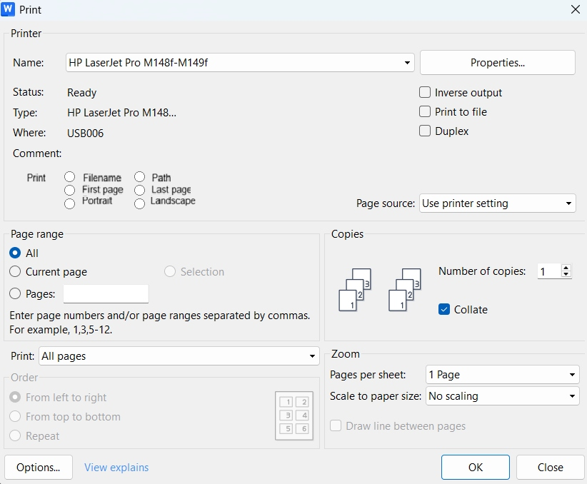
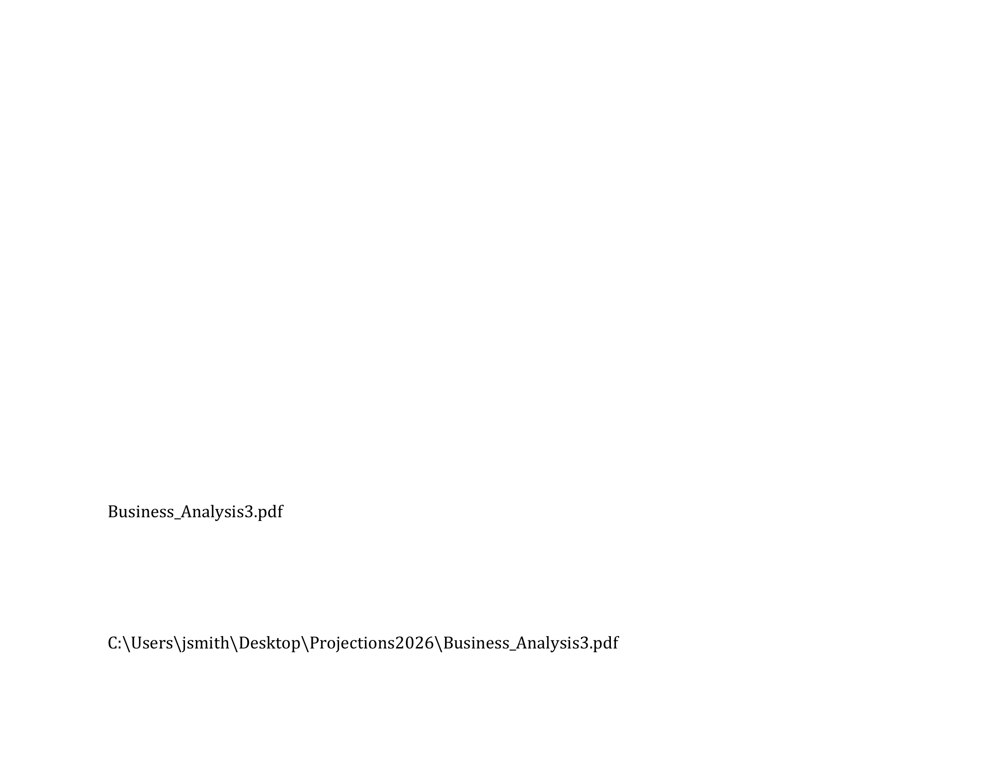

# Filename Printer

## Executive Summary

This proposal describes a Windows printing utility named **Filename Printer** that inserts a removable filename reference page at print time so users can identify physical printouts without modifying the source document. The feature is designed for Windows 11 on x64 and ARM64, works through the Windows print pipeline, and is optimized for professional users who regularly print multiple near-identical DOCX and PDF revisions.

## Problem

When users print multiple versions of the same document, it becomes difficult to match physical copies to their source files without reading each one in detail. This challenge multiplies when:

- Versions differ only in small details (scattered changes or late-stage edits).
- Multiple files exist with similar names, for example `Operating_Agreement_v7_clean.docx` and `Operating_Agreement_v7_marked.docx`.
- Printed copies must be kept for internal review versus external submission, but the physical documents are indistinguishable.

Current workarounds are fragmented and awkward:

- **Word headers/footers:** Require manually editing the document each time and tie the filename to the file itself, which is not suitable for submission copies.
- **PDF stamping tools:** Modify the PDF before printing and require preprocessing steps and document edits.
- **OEM watermarks:** Are device-specific, usually not filename-aware, and not easily toggleable per job.

There is no unified, app-agnostic, per-job solution that lets users print a filename or path on demand without modifying the source document or running separate preprocessing tools.

## Solution

The proposed solution is a Windows print-pipeline utility that adds a **single dedicated page**—either a **leading page** inserted before the document, or a **trailing page** appended after it—containing the filename and/or file path. This page is inserted at print time only; the original document remains untouched and its pagination is not altered.

## Key Features

- **Per-job toggle:** "Print filename page" on or off; no document edits needed.
- **Flexible placement:** Leading page (before page 1) or trailing page (after the last document page), with text positioned for easy visibility and handwritten notes.
- **Works across applications:** Any app that prints DOCX or PDF files through the Windows print pipeline gains this capability automatically.
- **Privacy-aware:** Automatically disabled for PDF printers, Fax, OneNote, and XPS printers to prevent accidentally baking filenames into saved files.
- **Handles edge cases:** Long filenames are truncated intelligently; non-ASCII characters (accents, emoji, CJK, Devanagari) are supported; text always respects printable margins.

## Why a Dedicated Page?

Adding a new blank page rather than overlaying onto the document's own content provides:

1. **Ample space** for even very long filenames and paths.
2. **Easy removal** if the print is destined for external review; the leading or trailing page can be removed before stapling.
3. **No interference** with document pagination, headers, footers, or existing content.
4. **Practical ergonomic benefit:** placing identifying information near the top on a first page and near the bottom on a last page helps users quickly spot it while flipping through stapled or collated documents.
5. **Room for notes** if the user wants to annotate a personal copy on the dedicated page.

## Platform Scope and Rationale

The utility is proposed for **Windows 11, 64-bit only**, including both **x64 and ARM64** systems. This keeps the product aligned with current Windows hardware direction while avoiding 32-bit complexity.

The Windows XPS/XPSDrv print pipeline is mature and suitable for this feature because it allows page insertion using standard XPS-oriented APIs without relying on separate PDF engines or document-rewrite workflows. The architecture is intended to be low-maintenance and compatible with modern Windows printing behavior.

## Blocked-Printer Behavior

When a printer name contains blocked terms such as "PDF," "Fax," "OneNote," or "XPS," the filename/path controls must be disabled and forced off immediately. If the user tries to re-enable them, the UI should revert them to off and show a tooltip such as: **"Disabled for PDF printers, Fax, OneNote, and XPS printers to avoid baking filenames into saved files."**

This rule must apply to printer names only, not document filenames. For example, a file named `Fax-from-Client-2024-12-23.pdf` should still be eligible for filename stamping when sent to a physical printer.

The utility uses the XPS print pipeline internally; this is independent of whether the Microsoft XPS Document Writer printer is installed or visible, and XPS-named printers are simply treated as blocked destinations for filename-page insertion.

## Real-World Use Cases

### Legal Drafts

A law firm iterates through near-identical versions such as `Operating_Agreement_v7_clean.docx` and `Operating_Agreement_v7_marked.docx` and prints several copies for redline review. With the filename page enabled, attorneys immediately see which file each printed set came from, instead of scanning for subtle wording differences. This is especially valuable when some versions are printed from Word and others from exported PDFs, which can end up with different pagination.

### Academic Revisions

A researcher submits multiple paper revisions to a conference, such as `paper_draft3.docx`, `paper_cameraReady.pdf`, and `paper_cameraReady_withAppendix.pdf`, and prints copies for co-authors, advisors, and the submission process. For internal collaboration, the filename page helps track which revision each person has. For the final submission to the conference, the researcher simply toggles the option off or removes the extra page, so reviewers see a clean, unmarked document.

## Why Now?

The Windows print pipeline (XPS/XPSDrv) has been stable and mature for over a decade, making it practical to build a reliable, low-maintenance filter that works across Windows 11 without complex driver management. At the same time, hybrid document workflows—where files exist in both Word and PDF forms, are revised frequently, and are printed selectively for different audiences—have become the norm in professional environments. A simple, built-in Windows solution addresses a genuine friction point in these workflows.

## Broader Market and Microsoft 365 Opportunity

Though legal and academic examples illustrate the benefits for professional use of the Filename Printer utility, the actual market is much broader. Even casual Windows users occasionally print documents and then file them away for months. When they rediscover a paper copy and want to update it but have forgotten the exact filename, they may end up re-creating the document, retyping it, or scanning and running OCR just to get back to an editable file.

This whole problem disappears if they used Filename Printer, because the filename page gives them the exact name they can paste into Windows Search to pull up the original file instantly.

Rather than trying to sell a standalone professional utility for, say, 19.99, Microsoft could simply include Filename Printer as part of Microsoft 365 so that it is available to millions of subscribers at no incremental cost. That makes it another small but meaningful unique selling proposition for Microsoft 365, where the additional subscription revenue and retention value are likely to exceed what could be earned selling it as a separate product. It also avoids the need for its own marketing budget and sales motion, further improving the overall economics of the feature.

## Fit for Microsoft

- Windows already ships built-in virtual printers such as XPS Document Writer, Print to PDF, and OneNote printers, and is actively evolving the modern print platform and protected print mode, including standardized IPP-based printing and print support apps.
- Microsoft is already investing to simplify printer drivers and manage print-pipeline changes, certification, and compatibility across Windows releases, which is exactly the long-term maintenance burden that makes this hard for a small vendor.
- A "Filename Printer" concept aligns with the goal of a consistent, driver-agnostic print experience, since it is purely a pipeline feature that works across applications and devices.
- The feature has low marginal cost for Microsoft, high utility for users, and fits naturally with Microsoft's ownership of the Windows print stack.

## Appendix A: Detailed Architecture

### File Type Support

The feature works for DOCX and PDF jobs only. These formats are prioritized because they cover most professional workflows and provide reliable filename metadata. For unsupported file types, the filter gracefully no-ops with no error and no extra page.

This is a deliberate constraint in the initial release; additional formats can be considered in future versions.

### XPS Pipeline Design

The solution uses the XPS print pathway (XPSDrv / XPS Print API) to:

- Keep all processing in a single, unified format, with no external PDF engine, separate file I/O, or extra merging step.
- Insert pages cleanly using standard XPS AddPage-style calls.
- Maintain compatibility across Windows 11 without complex OS-specific logic.

The filter is ordered late in the XPS pipeline, making it a **non-invasive overlay** that coexists with OEM watermarks and other driver features without conflicts.

In an XPS-centric path, a filter or virtual printer can create an extra XPS page and add it at the start or end of the job using the standard XPS print or driver APIs.

This architecture keeps the original document content unmodified, scopes the behavior per job, and centralizes overlay logic in a single feature filter that works across applications as long as they print through the Windows print pipeline.

### Printer Detection and Blocklist

The utility maintains a configurable blocklist for printer names:

- **Default blocklist:** `PDF`, `Fax`, `OneNote`, `XPS`
- **Detection rule:** Case-insensitive substring match against the printer queue name, not the document filename.
- **Behavior:** When a blocked printer is detected, the filename/path toggles are disabled and forced to Off.
- **Event handling:** If the user attempts to enable the toggle while a blocked printer is selected, it immediately reverts to Off.
- **Privacy rationale:** Prevents users from accidentally baking sensitive filenames into PDFs saved via Print to File or sent via fax.

**UI tooltip:** "Disabled for PDF printers, Fax, OneNote, and XPS printers to avoid baking filenames into saved files."

### Page Layout

In the table below, “First page” and “Last page” refer to the physical sheet where the filename page is printed, used as a leading or trailing page at print time. Filename and path are placed at fixed device-independent coordinates, adjusted for page orientation and size.

| Page | Orientation | Item | Distance from top | Distance from left |
|---|---|---|---|---|
| First page | Portrait | Filename | 3 cm | 3 cm |
| First page | Portrait | Path | 6 cm | 3 cm |
| First page | Landscape | Filename | 3 cm | 3 cm |
| First page | Landscape | Path | 6 cm | 3 cm |
| Last page | Portrait | Filename | 22 cm | 3 cm |
| Last page | Portrait | Path | 26 cm | 3 cm |
| Last page | Landscape | Filename | 14 cm | 3 cm |
| Last page | Landscape | Path | 17 cm | 3 cm |

Text is always rendered at least 12 pt for legibility. A settings UI allows users to customize font size within 12–20 pt bounds.

### Long Filenames and Truncation

**Primary rule:** Filenames of 100 characters or fewer are rendered in full. Longer filenames are truncated as follows: **first 90 characters** + ellipsis (`…`) + **last 10 characters**.

**Wrapping fallback:** If space is tight, filenames can wrap to multiple lines within 3 cm left-margin and 1 cm right-margin boundaries.

If no usable filename is available, the utility does not insert a filename page for that job.

**Unicode handling:** Truncation operates on Unicode scalar values, not bytes, to avoid splitting multi-byte characters, which is important for Hindi, CJK, emoji, and similar scripts.

### Non-ASCII Characters and Fonts

Filenames may contain accented characters, emoji, CJK scripts, Devanagari, and other Unicode content. The filter handles this robustly:

- **Character encoding:** Filenames are treated as full Unicode strings throughout, with no ANSI or code-page coercion.
- **Font selection:** Uses a Unicode-capable system UI font such as Segoe UI or Arial that supports a wide range of scripts.
- **Fallback:** Relies on standard XPS font fallback; if a glyph is unavailable, the platform substitutes an appropriate alternative or placeholder without failing the job.
- **Embedding:** When possible, embeds the glyph subset for the filename text so downstream devices can render characters even without the original font. If embedding is disabled by policy, device-side fonts and standard fallback apply.

### Comparison with Existing Approaches

| Method | Per-job toggle | App-agnostic | Modifies document | First-page-only |
|---|---|---|---|---|
| Word header/footer | No | No | Yes | Possible but manual |
| PDF stamping tools | Sometimes | Partly | Yes (PDF) | Tool-dependent |
| OEM driver watermark | Yes | Device-specific | No | Usually no |
| This proposal | Yes | Yes (Win 11+) | No | Yes |

### Non-Goals and Limitations

- **Does not overlay onto document content:** Adding text to existing pages is complex and risks obscuring content. Instead, a dedicated page is cleaner and safer.
- **Does not support image-only jobs:** Jobs without reliable filename metadata in spooler data are skipped gracefully.
- **Initial scope is DOCX/PDF:** Other formats may be added in future versions.
- **Does not modify pagination:** The extra page is not counted in the document's own page numbers.

### Success Metrics

- Filename page appears correctly across at least 10 common printers and standard paper sizes (A4, Letter, Legal).
- Zero failures or regressions when printing to blocked printers; toggles remain disabled.
- Document content, pagination, and headers/footers are completely unmodified.
- Long filenames and non-ASCII characters render cleanly or degrade gracefully.

### Localization Readiness for Other Languages

Version 1 of the Filename Printing App is proposed for English (en-US) only, but the architecture deliberately prepares for additional languages. This utility is designed from the outset to support future language versions such as Spanish, Portuguese, Hindi, Russian, Japanese, German, French, Korean, Simplified Chinese, and Traditional Chinese without changing the core print pipeline.

- All **user-visible text** (labels, button captions, tooltips, dialog messages, and short in-product help) is stored in language resource files rather than hard-coded in source code. The UI retrieves text strictly by resource ID, so adding a new language is a matter of providing additional resource bundles and rebuilding.
- Layout uses standard Windows controls that auto-size to content where possible, with sufficient padding to accommodate longer strings in languages such as Spanish and different character widths in CJK scripts without clipping or overlap. No control is sized solely for English text or assumes a particular word order.
- All in-product explanations, including the blocked-printer tooltip, and any bundled quick-start text are authored as localizable text blocks and managed alongside UI resource files so they can be translated together into target languages.

## Mockups






[← Back to summary](../README.md)
```
