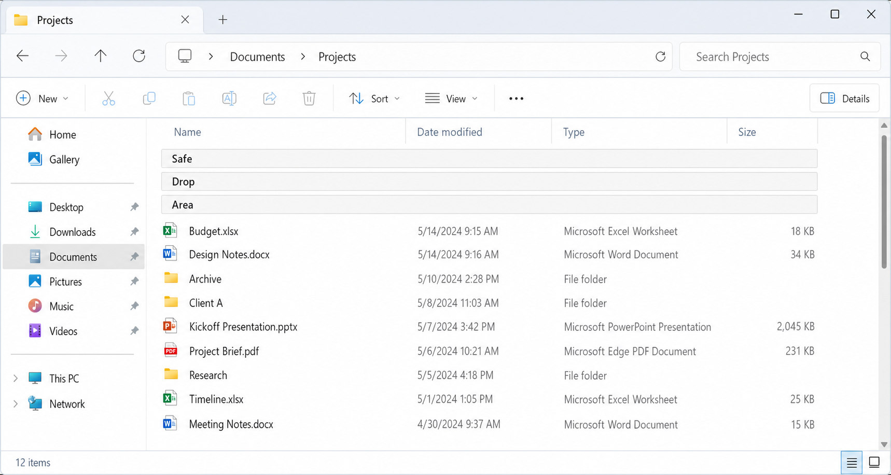

# Safe Drop Area for Windows File Explorer

## Overview

Safe Drop Area is a proposed File Explorer feature that adds a pinned, protected drop target at the top of applicable folder views. When enabled, it gives users a clear and reliable place to drop files and folders into the currently open folder without accidentally targeting a subfolder.

The feature is intended to reduce a long-standing drag-and-drop usability problem in crowded folder views, especially during desktop and folder reorganization tasks. It preserves existing Explorer move/copy semantics and focuses only on improving target safety and discoverability rather than changing the broader drag-and-drop model.

## User Problem

Users frequently reorganize files by dragging items from the desktop or one folder window into another. In dense Details/List-style folder views, there may be little or no blank area available to safely target the current folder itself.

As a result, users can accidentally drop onto a visible subfolder rather than into the currently open folder. This can cause files or folders to appear to disappear into the wrong location, forcing the user to search for the misplaced item or rely on Undo after the fact. Existing mitigations such as drag-threshold tuning, confirmation tools, or disabling drag-and-drop either reduce convenience, add friction, or address the error only after it has already occurred.

## Scenario

A user is reorganizing desktop files into a crowded destination folder in File Explorer. The folder contains many subfolders and documents, leaving no obvious empty area where an item can be safely dropped into the current folder.

With Safe Drop Area enabled, the user sees a fixed target at the top of the folder view and can drop onto it with confidence. The drop is routed to the currently open folder using Explorer's existing move/copy rules, while intentional direct drops onto subfolders continue to work normally.

## Requirements

### Functional requirements

- File Explorer shall provide a Safe Drop Area in applicable Details/List-style folder views.
- The Safe Drop Area shall appear at the top of the folder contents as pinned virtual rows.
- The Safe Drop Area shall always target the currently open folder, not a subfolder.
- The Safe Drop Area shall be controlled by a single global preference.
- When enabled in one applicable Explorer window, the Safe Drop Area shall appear in all applicable Explorer windows.
- When disabled, the Safe Drop Area shall be hidden in all applicable Explorer windows.
- The Safe Drop Area shall remain visible while enabled and shall not appear only during drag operations.
- The default configuration shall use three virtual rows.
- Users shall be able to switch to a one-row compact mode through settings.
- Dropping onto the Safe Drop Area shall preserve existing Explorer drag-and-drop semantics, including normal move/copy behavior based on source, destination, drive boundaries, modifier keys, and shell context.

### Interaction requirements

- The Safe Drop Area rows shall not be treated as real files or folders.
- The rows shall not be renameable, movable, sortable, openable, or deletable.
- The Safe Drop Area shall remain fixed at the top of the folder view while real items scroll below it.
- Direct drops onto real subfolders shall continue to work normally.
- The feature shall be exposed as a toggle in the Explorer View UI.
- Hovering over the Safe Drop Area checkbox in the View command surface shall show the tooltip: "Show a fixed safe area at the top of the folder where drops always go into this folder."
- The implementation may persist the preference similarly to other global Explorer view behaviors, such as Folder Options or registry-backed settings, but the primary user-facing control shall be the View UI.

### UX requirements

- The Safe Drop Area shall be visually distinct from real file and folder rows.
- The feature shall be easily discoverable while users are working inside Explorer.
- The default experience shall prioritize a forgiving drop target over minimum vertical space usage.
- Labeling shall clearly communicate that dropping onto the area places items into the current folder.

## Non-Requirements

- The feature does not replace intentional drag-and-drop into subfolders.
- The feature does not introduce a confirmation step for all drag-and-drop operations.
- The feature does not disable drag-and-drop.
- The feature does not modify the underlying Explorer move/copy rules.
- The feature does not define behavior for icon, tile, gallery, or touch-optimized layouts in its initial scope.
- The feature does not redesign Explorer navigation, sorting, grouping, or other file-management behaviors outside the protected drop target itself.

## Acceptance Criteria

### Core behavior

- When the global Safe Drop Area setting is turned on, a pinned Safe Drop Area appears in all applicable Details/List-style Explorer windows.
- When the global setting is turned off, the Safe Drop Area disappears from all applicable Details/List-style Explorer windows.
- In default mode, the Safe Drop Area renders as three pinned virtual rows at the top of the folder view.
- In compact mode, the Safe Drop Area renders as one pinned virtual row at the top of the folder view.
- The Safe Drop Area remains visible while enabled, regardless of whether a drag operation is active.

### Drag-and-drop behavior

- Dropping onto the Safe Drop Area places the item into the currently open folder.
- Dropping directly onto a subfolder continues to place the item into that subfolder.
- Explorer applies the same move/copy behavior to drops on the Safe Drop Area that it would apply to a normal drop into the current folder under the same conditions.
- Modifier keys continue to affect the operation exactly as they do in standard Explorer drag-and-drop.

### UI and interaction

- The Safe Drop Area does not appear as a real file or folder entry.
- Users cannot rename, open, move, sort, or delete the Safe Drop Area.
- The Safe Drop Area remains pinned while normal folder contents scroll underneath it.
- The feature is available through a Safe Drop Area toggle in the Explorer View UI.
- Hovering over the View UI toggle displays the expected tooltip text.

### Quality bar

- A user unfamiliar with the feature can recognize that the Safe Drop Area is a special target and successfully use it to drop an item into the current folder.
- The feature reduces accidental subfolder drops in crowded Details/List-style folder views without disrupting existing intentional drag-and-drop workflows.

## Mockup



[← Back to summary](../README.md)
```
